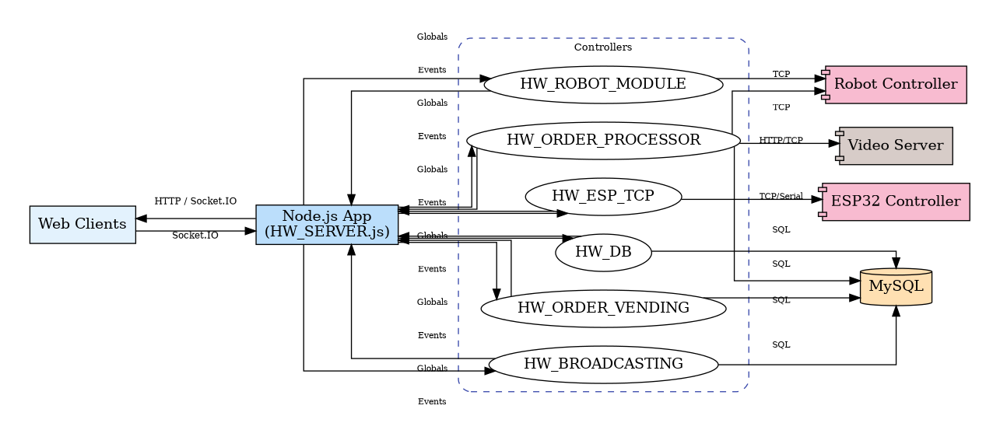

# Hot Wheels Project Architecture Analysis

The vending machine system uses a Node.js backend with Express for HTTP handling and Socket.IO for real-time communication. It interfaces with physical hardware through serial connections and a robot control interface. The system maintains state in a MySQL database and provides different interfaces for customers and operators. The architecture follows a modular approach with clear separation between web serving, database operations, and hardware control.

## Getting Started

To generate the documentation:

```bash
npm start
```

```bash
npm run docs
```

Then open \HOTWHEELS\docs\index.html

To watch for changes and automatically regenerate documentation:
```bash
npm run docs:watch
```

The documentation will be generated in the `docs/` directory.

## Core Components Hierarchy

1. Entry Point: HW_SERVER.js
This is the main entry point that bootstraps the entire application:
	1. Initializes the Express server (S1_APPX)
	2. Sets up Socket.IO (S2_IO)
	3. Establishes database connections
	4. Configures serial port communication with hardware
	5. Loads routing and other modules

2. Key Modules and Their Relationships

```
HW_SERVER.js
├── HW_ROUTING.js (Web routes)
  
├── HW_SIO.js (Socket.IO communication)
  
├── HW_DATABASE.js (Database operations)
  
├── HW_COMMANDS.js/HW_POSTING.js (HTTP request handlers)
  
├── HW_ROBOT.js (Robot control interface)
  
└── Views (EJS templates)
  
  ├── __HW_INVENTORY.ejs
    
  ├── __HW_SIO.ejs
    
  └── Other view templates
```

## Object/Module Relationships

### Main Application Object: S1_APPX
1. Created in HW_SERVER.js
2. Passed to most modules as a parameter
3. Serves as a shared context for the entire application
4. Contains references to:
	1. Express server instance
	2. Socket.IO instance (GLOBALS.SIO)
	3. Database connection (GLOBALS.HW_DB_CONNECTION)
	4. Serial port connection (S1_APPX.SERIAL_PORT)

### Socket.IO Communication
1. S2_IO is initialized in HW_SERVER.js
2. Attached to S1_APPX as GLOBALS.SIO
3. Configured in HW_SIO.js through the S2CON function
4. Handles real-time communication between server and clients

### Database Connection
1. Initialized in HW_DATABASE.js through HW_DB_CONNECT
2. Attached to S1_APPX as GLOBALS.HW_DB_CONNECTION
3. Provides database operations for inventory, orders, etc.

## Communication Flow

1. Client-Server Communication
	1. HTTP Routes: Defined in HW_ROUTING.js
		1. Handles page rendering and basic HTTP requests
		2. Example: /HW_INVENTORY, /HW_DASHBOARD, etc.
	2. Socket.IO Events: Defined in HW_SIO.js
		1. Real-time bidirectional communication
		2. Client emits events like MFC (Message From Client)
		3. Server responds with events like MFS (Message From Server)
		4. Messages typically formatted as terminal___action___message
	3. HTTP POST Endpoints: Defined in HW_COMMANDS.js/HW_POSTING.js
		1. Handle form submissions and API requests
		2. Example: /CLIENT_ORDER_PLACED, /HW_OPERATOR_REQUEST

2. Hardware Communication
   1. Serial Port: Configured in HW_SERVER.js
		1. Communicates with vending machine hardware
		2. Listens for incoming data and forwards to Socket.IO clients
		3. Sends commands to hardware
   2. Robot Control: Implemented in HW_ROBOT.js
		1. Communicates with a robot (likely the picking mechanism)
		2. Uses TCP socket connection on port 30002
		3. Sends commands and receives status updates

3. Video Server Communication
	1. TCP socket connection to a separate video server
	2. Used for recording of racing cars and compiling it into a raceVideo which can be retrieved by customer via qrcode
	3. Implemented in multiple places (HW_COMMANDS.js, HW_ROBOT.js)

## Program Logic

1. Initialization Sequence
	1. HW_SERVER.js starts the Express server
	2. Socket.IO is initialized and attached to the Express server
	3. Database connection is established
	4. Serial port connection is opened
	5. Routes are registered
	6. Robot communication is initialized

2. Customer Functions / Vending Process Flow
	1. Customer selects cars through the web interface
	2. Order is placed via /CLIENT_ORDER_PLACED endpoint
	3. Order is stored in the database
	4. Robot is instructed to pick the selected cars
	5. Video server records the process
	6. Customer receives their cars

3. Operator Functions
	1. Inventory management through /HW_INVENTORY interface
	2. QR code generation and management
	3. Cassette filling and emptying
	4. System monitoring through dashboard
	5. Hardware control and testing

## Key Communication Patterns
1. Three-part Message Format:
    1. Most Socket.IO messages follow terminal___action___message format
    2. Parsed in client-side JavaScript to determine actions
2. Database as Central State:
    1. Inventory, orders, and system state stored in MySQL
    2. Multiple components query and update the database
3. Hardware Command Pattern:
    1. Commands sent to hardware via serial port

## Docker Setup

The repository includes a multi-stage Dockerfile and Docker Compose stack to run the Hot Wheels application alongside MySQL. Containers default to hardware-free mode; enable robot/ESP integrations only when the required devices or simulators are available.

### Prerequisites
- Docker Engine 24+ (or Docker Desktop)
- Docker Compose V2 (`docker compose` command)
- Optional: `make` if you prefer wrapper targets

### Key Environment Variables

| Variable | Description |
| --- | --- |
| `HW_SERVER_PORT` | HTTP port the Node service listens on (default `3101`). |

## Robot Base Frame Calibration

### High-Level Flow

```
[Browser calibration UI]
       │  fetch /api/calibration/state
       │  POST /api/calibration/command|capture|verify|reset
       ▼
[Express routes in HW_ROBOT_MODULE.js]
       │  load/update
       ▼
[calibrationStore.js] ──► calibrationState.json (or volume mount)
       ▲
       │  UR scripts / robot polling
       ▼
[Robot helpers] ──► UR controller (30002) ──► physical robot
```

- **UI layer** (`views/__HW_ROBOT_CALIBRATION.ejs`): step wizard, jog controls, polling loop (`/api/calibration/robot-status`) to keep TCP/flags live.
- **HTTP API** (all in `HW_ROBOT_MODULE.js`):
  - `GET /HW_ROBOT_CALIBRATION` renders the page.
  - `GET /api/calibration/state` returns merged calibration state + robot snapshot.
  - `POST /api/calibration/command` handles workflow actions (goto, safe travel, baseline, move/nudge) and dispatches UR scripts.
  - `POST /api/calibration/capture` stores the current TCP pose for reference/corner points.
  - `POST /api/calibration/verify` / `reset` toggle workflow flags or wipe state.
- **State persistence** (`src/server/config/calibrationStore.js`):
  - Normalises workflow flags, computes derived metrics (vector length *a*, angle α, translation offsets) before saving.
  - Persists JSON either to `src/server/config/calibrationState.json` (dev) or to a mounted path when `HW_CALIBRATION_STATE_PATH` is set (e.g. `/app/calibration-data/calibrationState.json` in Docker).
- **Robot integration**:
  - Motion helpers (e.g. `HW_ROBOT_CALIBRATION_GOTO_CASSETTE`, `HW_ROBOT_CALIBRATION_TRAVEL_SAFE`) build UR scripts using templates from `HW_ROBOT_UR_SCRIPTS.js`.
  - Cassette poses are pulled from MySQL (`hwv00_cassettes`) and converted into TCP coordinates via `HW_ROBOT_CALC_POSXY_FROM_CASNR`, honouring machine geometry set in `src/server/config/configRobot/HW_robot_config.js`. // `src/server/config/configRobot.js`.
  - Helpers such as `waitForRobotIdle`, `waitForRobotPose`, and `waitForRobotDisplacement` poll `robotStatus` to gate each calibration step before it can advance.

### Step Lifecycle (Orientation Example)

1. **Go to cassette 1**: UI posts `gotoCassette` → server sends UR script, resets workflow flags, waits for idle + target pose, then marks Step 1 complete.
2. **Jog & confirm corner**: Operator uses jog controls (`nudge` commands). `orientationAlignConfirm` captures the current TCP pose and stores cassette 1 reference.
3. **Safe travel**: `orientationTravelSafe` runs the safe travel script, waits for displacement, and unlocks the baseline step.
4. **Record baseline**: `orientationBaselineConfirm` validates the robot is idle, captures the cassette 153 entry pose, and triggers recalculation of *a* and α.

Translation steps follow the same pattern (return → capture reference → capture fitted pose → verify), producing Δx/Δy offsets once both points are stored.

### Running in Docker

- Mount a writable directory for calibration data, e.g. `-v ./calibration-data:/app/calibration-data` and set `HW_CALIBRATION_STATE_PATH=/app/calibration-data/calibrationState.json`.
- Only enable `HW_ROBOT_ENABLED=true` when the UR controller (or simulator) is reachable; otherwise the UI still loads but commands are no-ops.
| `HW_DB_HOST`, `HW_DB_USER`, `HW_DB_PASSWORD`, `HW_DB_NAME` | MySQL connection details used by the app. |
| `HW_ROBOT_ENABLED`, `HW_ESP_ENABLED` | Toggle hardware modules; leave `false` for container-only runs. |

Override values directly in `docker-compose.yml` or provide an env file via `docker compose --env-file`. The Node app still respects `.env` for local (non-container) execution.

### Build & Run

```bash
# remove previous stack and named volumes (resets MySQL)
docker compose down -v

# rebuild application image after Dockerfile changes
docker compose build

# start app + MySQL; follow logs until "System ready"
docker compose up
```

On first launch the MySQL container loads `bu_databse/250526_hw_db.sql`. Subsequent runs reuse the `hotwheels_mysql_data` volume unless you drop it with `docker compose down -v`.

### Database Seeding
- Both `hw11_2_jazan` (production) and `hw11_dev` (test) databases are loaded automatically.
- Seed files `bu_databse/250526_hw_db.sql` and `bu_databse/hw11_dev.sql` include `CREATE DATABASE IF NOT EXISTS` and `USE` statements so each schema loads into its own database.
- They also create the shared MySQL user: `CREATE USER IF NOT EXISTS 'hotwheels'@'%' IDENTIFIED BY 'strongpassword';` followed by `GRANT ALL PRIVILEGES ON <db>.* TO 'hotwheels'@'%';`.
- If you change or reorder database dumps, keep the `01_*.sql` / `02_*.sql` naming convention so entrypoint execution order remains deterministic.

### Logs & Generated Assets

The custom entrypoint creates and owns these directories before the app starts, solving permission issues with named volumes:
- `/app/logs` → `logs` volume (rotating Winston output)
- `/app/public/qr`, `/app/public/qrOperator` → generated QR codes
- `/app/public/video` → compiled race videos

Mount host paths instead of named volumes if you need direct filesystem access.

### Hardware Notes
- The server runs as the `node` user inside the container. Hardware toggles (`HW_ROBOT_ENABLED`, `HW_ESP_ENABLED`) remain `false` unless you provide device passthrough (`--device=/dev/ttyUSB0`) or host networking.
- Express binds to `0.0.0.0` in the container. Logs show the bridge IP (e.g. `172.x.x.x`) while external clients connect via the published port (`http://localhost:3101`).

### Useful Commands

```bash
# Tail application logs from the running service
docker compose logs -f app

# Open a shell inside the app container (root user)
docker compose exec app bash

# Snapshot the MySQL schema/data into the host backups folder
docker compose exec mysql mysqldump -u hotwheels -p hw11_2_jazan > backups/hw_dump.sql
```

Extend this section as additional services (video workers, simulators, etc.) are containerised.

### Git Commands
- Clone via SSH (after key setup): `git clone git@github.com:ORG/REPO.git`.
- Check current status: `git status`.
- Fetch latest references: `git fetch origin`.
- Switch to a branch: `git checkout feature/dockerize-hotwheels` (replace with desired branch).
- Create a new branch tracking origin: `git checkout -b new-branch origin/new-branch`.
- Pull latest changes on the current branch: `git pull` (for a specific branch: `git pull origin feature/dockerize-hotwheels`).
- Push commits: `git push origin feature/dockerize-hotwheels`.
- Discard local changes and sync to remote branch: `git fetch origin && git reset --hard origin/feature/dockerize-hotwheels`.

## Local MySQL Setup
When running the app directly on your host, create a dedicated MySQL account that matches `.env.local`:

```sql
CREATE USER 'hotwheels'@'localhost' IDENTIFIED BY 'strongpassword';
GRANT ALL PRIVILEGES ON hw11_2_jazan.* TO 'hotwheels'@'localhost';
FLUSH PRIVILEGES;
```

If the user already exists, run `ALTER USER 'hotwheels'@'localhost' IDENTIFIED BY 'strongpassword';` instead of `CREATE USER`. Update `.env.local` if you choose a different credential.

## Testing

The code base ships with Jest unit and integration tests plus manual system checks described in `TestPlan.md`.

### Local (host) run

```bash
# install dependencies
npm install

# execute all Jest suites
npm test

# run a single test file
npm test -- tests/integration/robot_gripper_commands.int.test.js

# collect coverage
npm test -- --coverage
```

### Docker run

If you work inside the Docker stack, use the `app` service container:

```bash
docker compose exec app sh -lc "npm test"

# targeted run
docker compose exec app sh -lc "npm test -- --runTestsByPath tests/unit/hw_robot_calc_posxy.test.js"
```

> **TIP:** ensure the container has the latest test files (copy them in or rebuild the image) before running the targeted command.

### Manual system checks

System-level scenarios (robot failover, kiosk flow, ESP reconnect) are documented in `TestPlan.md` under TC-SYS-0X. They require access to the physical hardware and are executed manually before major releases.



## Windows Deployment (OptiPlex 3020)

### 1. Connectivity
- Connect the OptiPlex to the Ubuntu laptop (Wi-Fi on laptop, Ethernet between machines).
- On Ubuntu: **Settings → Network → Wired → gear icon → IPv4** → set **Shared to other computers**.
- On Windows (PowerShell as Admin):
  ```powershell
  ipconfig /release
  ipconfig /renew
  ipconfig
  ```
  Expect `10.42.0.x` with gateway `10.42.0.1`.
- Verify internet reachability: `ping 10.42.0.1` and `ping 8.8.8.8`.
- Restart the Ubuntu machine

### 2. Tooling
- Docker Desktop (Linux containers): https://www.docker.com/products/docker-desktop/
- Git for Windows: https://git-scm.com/download/win
- Visual Studio Code (optional): https://code.visualstudio.com/
- If Docker warns about WSL: run elevated PowerShell `wsl --update` and reboot if requested.
- Confirm architecture if you are unsure which installer to download: `wmic os get osarchitecture` (or `systeminfo | find "System Type"`).

### 3. Clone via SSH
1. Generate key (Git Bash):
   ```bash
   ssh-keygen -t ed25519 -C "optiplex-hw"
   eval "$(ssh-agent -s)"
   ssh-add ~/.ssh/id_ed25519
   clip < ~/.ssh/id_ed25519.pub
   ```
2. Paste the public key into GitHub (account SSH keys or repo deploy keys).
3. Test: `ssh -T git@github.com`.
4. Clone:
   ```powershell
   mkdir C:\Projects
   cd C:\Projects
   git clone git@github.com:ORG/REPO.git
   ```

### 4. Hardware Reachability
- Ensure OptiPlex can reach controllers: `ping 192.168.1.11`, `ping 192.168.1.20`.
- Adjust routing or Docker networking (`network_mode: host`) if the container later fails to connect.

### 5. Run Containers
```powershell
docker compose --env-file .env.docker build
docker compose --env-file .env.docker up
```
- Follow logs: `docker compose logs -f app`.
- Access UI: `http://localhost:3101/HW`.
- Watch for hardware connection success messages in the logs.

### Windows Troubleshooting
- **`npm ci` fails during build** – ensure `package-lock.json` is present in the repository (remove it from `.gitignore` if necessary). Docker copies the lock file into the image so dependencies install deterministically.
- **Entrypoint reports `no such file`** – Windows converts shell scripts to CRLF. Reconvert with `tr -d '\r' < scripts/docker-entrypoint.sh > scripts/docker-entrypoint.tmp && mv scripts/docker-entrypoint.tmp scripts/docker-entrypoint.sh && chmod +x scripts/docker-entrypoint.sh`, or disable Git’s CRLF conversion (`git config core.autocrlf false`) before rebuilding.
- **MySQL container stuck “unhealthy”** – adjust the healthcheck to use `mysqladmin ping -h localhost -uroot -p$$MYSQL_ROOT_PASSWORD`. If `HOST ... is not allowed` appears, reset the DB volume (`docker compose down -v`) so the seed script re-creates grants, or grant `'hotwheels'@'%'` manually.
### Prerequisites
- Windows 10/11 with admin access
- Docker Desktop (WSL2 backend enabled)
- Git or a zip of the project sources
- Access to the same LAN as the robot/ESP hardware (wired or via shared connection)

### Internet Access via Ubuntu Bridge
If the OptiPlex lacks Wi-Fi, you can borrow connectivity from an Ubuntu laptop:
1. **On Ubuntu**: connect to Wi-Fi, plug the Ethernet cable between laptop and OptiPlex.
2. Open **Settings → Network**, select the wired connection, click the gear icon.
3. In the **IPv4** tab choose **Shared to other computers**, save, then toggle the wired connection off/on.
4. **On Windows**: connect the Ethernet cable, then open **Opdrachtprompt** and run:
   ```
   ipconfig /release
   ipconfig /renew
   ipconfig
   ```
   You should receive a 10.42.x.x address (Ubuntu’s shared subnet). Verify connectivity with `ping 10.42.0.1`.

### Docker Compose on Windows

If Docker Desktop reports that the WSL kernel is outdated, open an elevated PowerShell window and run:
```powershell
wsl --update
```

1. Clone or copy the project to the PC (e.g. `C:\Projects\HOTWHEELS`).
2. Review `.env.docker` and update IPs/credentials (robot, ESP, exposed ports) if they differ.
3. In PowerShell or Command Prompt run:
   ```powershell
   cd C:\Projects\HOTWHEELS
   docker compose --env-file .env.docker build
   docker compose --env-file .env.docker up
   ```
4. Monitor the stack with `docker compose logs -f app`; you should see “System ready” once MySQL and hardware connections succeed.
5. Access the UI at `http://localhost:3101/HW` and confirm robot/ESP connectivity.

### Notes
- Bind mounts in `docker-compose.yml` use Docker named volumes by default; adjust to host paths if operators need file access (logs, QR codes, video output).
- If the robot is on a different subnet, consider `network_mode: host` or additional routing; otherwise the default NAT bridge can reach 192.168.x.x networks.
- For native (non-docker) runs on Windows, source `.env.local` equivalents and ensure the `hotwheels@localhost` MySQL user exists as described in the Local MySQL Setup section.

*** End of File
*** End Patch
